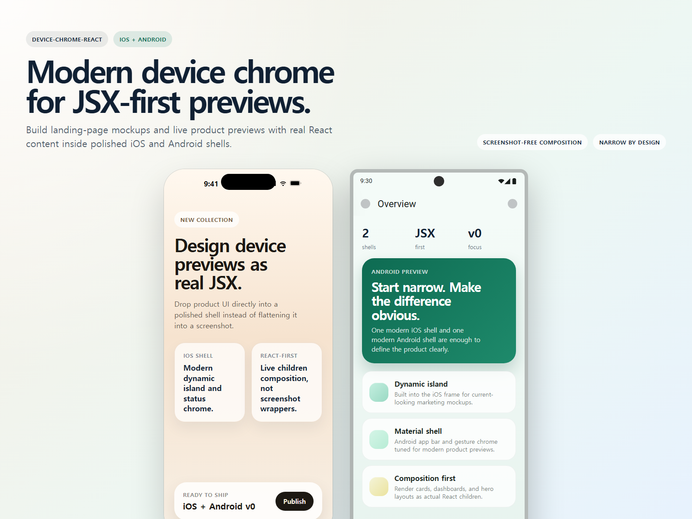

# device-chrome-react

Modern, JSX-first iOS and Android device chrome components for React.

`device-chrome-react` is built for landing pages, product showcases, mockups, and live previews where you want to render real React UI inside a device shell instead of dropping in static screenshots.



## Why this exists

Most device-frame packages are optimized for:
- screenshot wrappers
- iframe previews
- large, older CSS device catalogs

This package takes a different angle:
- modern iOS and Android chrome
- real `children` composition
- self-contained TSX components
- lightweight usage in marketing pages and demos

The goal is simple: make device framing feel like normal React composition.

## What ships today

- `IOSDeviceFrame`
- `IOSStatusBar`
- `IOSDynamicIsland`
- `IOSHomeIndicator`
- `AndroidDeviceFrame`
- `AndroidStatusBar`
- `AndroidAppBar`
- `AndroidGestureBar`

## Install

```bash
npm install device-chrome-react
```

If the package name is unavailable at publish time, rename it before release.

## Usage

```tsx
import { AndroidDeviceFrame, IOSDeviceFrame } from "device-chrome-react"

export default function Preview() {
  return (
    <div style={{ display: "flex", gap: 24, flexWrap: "wrap" }}>
      <IOSDeviceFrame width={390} height={844}>
        <div
          style={{
            height: "100%",
            background: "#f5efe4",
            padding: 24,
            paddingTop: 96,
          }}
        >
          iOS screen content
        </div>
      </IOSDeviceFrame>

      <AndroidDeviceFrame width={412} height={892} title="Preview">
        <div
          style={{
            height: "100%",
            background: "#f4fbf8",
            padding: 24,
          }}
        >
          Android screen content
        </div>
      </AndroidDeviceFrame>
    </div>
  )
}
```

## Repo preview asset

The screenshot above is generated from the actual React components in this repo.

```bash
npm install
npm run preview:render
```

That command refreshes [examples/readme-preview.html](./examples/readme-preview.html), which can be opened directly in a browser before recapturing [media/readme-preview.png](./media/readme-preview.png).

## Live Preview Tool

For quick no-build checks, open [examples/live-device-preview.html](./examples/live-device-preview.html) directly in a browser.

It supports:
- public site URLs
- localhost or dev server URLs
- GitHub Pages-style URLs from repo input
- a single local HTML file
- a best-effort static folder preview based on `index.html`
- shareable presets with query params like `?url=https://your-preview` or `?github=owner/repo`

Notes:
- Services that block iframe embeds with `X-Frame-Options` or `frame-ancestors` will not render inside the tool.
- The GitHub converter assumes your repo is published on GitHub Pages.
- The folder uploader is best for static HTML/CSS/image bundles. JS-heavy apps usually work better through a local dev server URL.

## Why only two device types?

Because early focus is a feature, not a limitation.

Many open-source device-frame libraries have broad catalogs, but they often end up:
- visually dated
- screenshot-first instead of JSX-first
- heavier than they need to be for simple marketing and preview use cases

This project is intentionally starting with:
- one strong modern iOS shell
- one strong modern Android shell
- clean React-first composition

That is enough to make the positioning clear for a strong v0. More variants can follow once the core API and visual direction are solid.

## Roadmap ideas

- iPhone size variants
- Pixel size variants
- tablet frames
- browser window frames
- landscape support
- safe-area helper overlays
- motion presets for showcase layouts

## Disclaimer

This package is unofficial and is not affiliated with Apple or Google.
It is intended for mockups, previews, marketing pages, and design showcases.

